#  CC Lab 01 – Ubuntu Server Installation (VMware)

**Name:** Sadaf Riaz  
**Registration No:** 2023-BSE-073  
**Class:** BSE-5B  

---

##  Objective
To learn how to install and configure **Ubuntu Server** inside a **VMware Virtual Machine**.

---

##  Steps Performed

###  Step 1: Open VMware Workstation
- Launch VMware on your system.
- Create a **New Virtual Machine**.

Screenshots:  
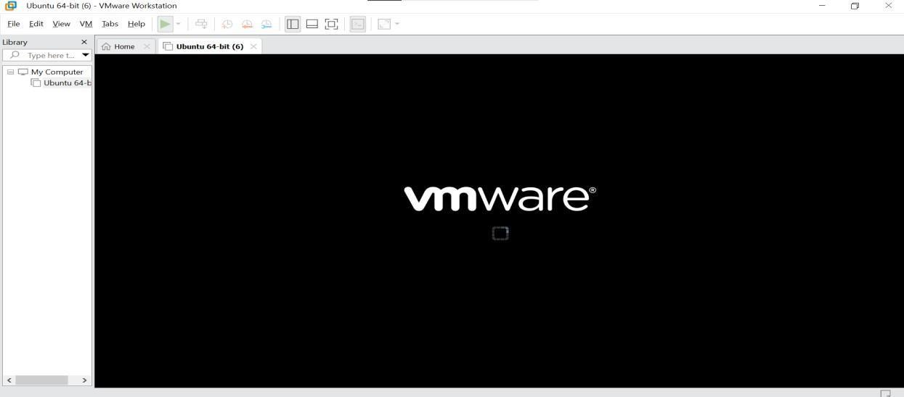  
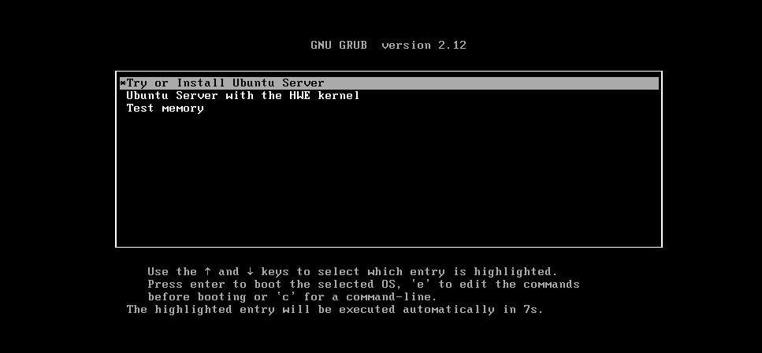  
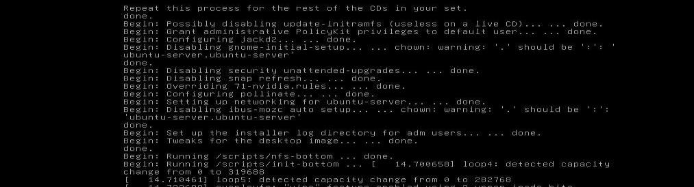

---

###  Step 2: Load Ubuntu ISO
- Browse and select the **Ubuntu Server ISO file**.
- Make sure to check **“Unblock”** in file properties before using.

?? Screenshots:  
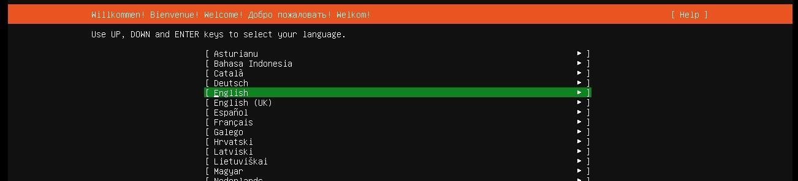  
  
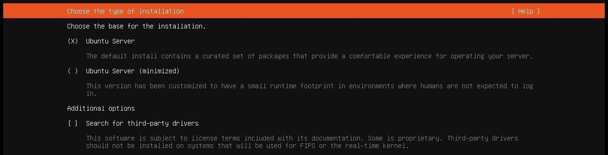  
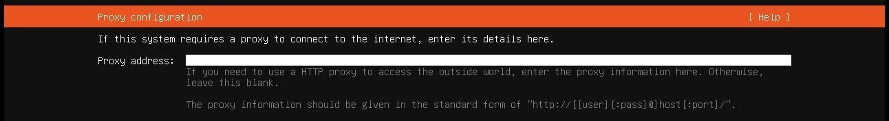  
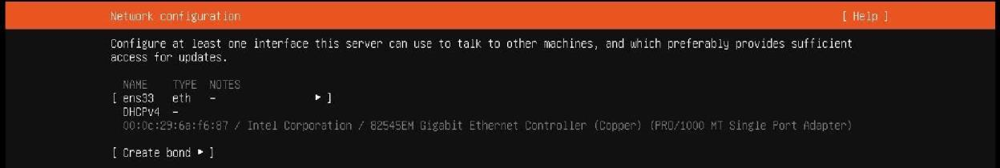

---

###  Step 3: Configure VM Settings
- Allocate memory, disk space, and network configuration.
- Continue until ready to start the virtual machine.

?? Screenshots:  
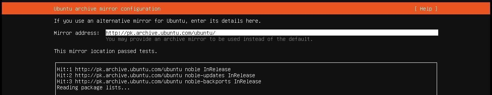  
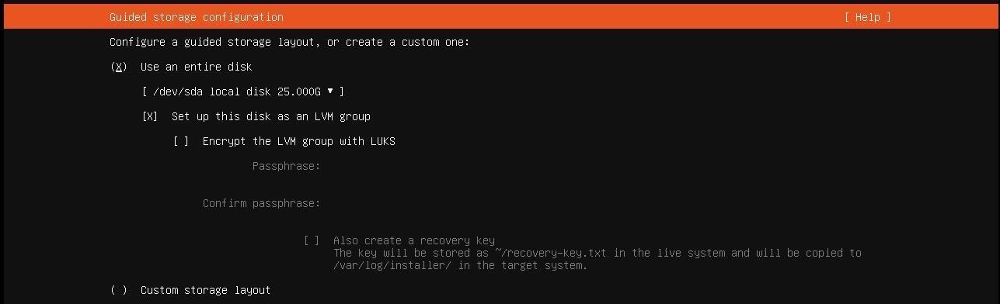  
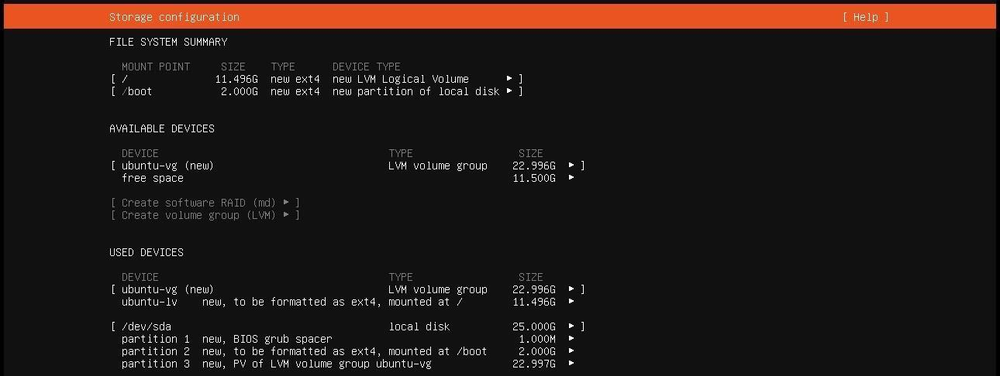  
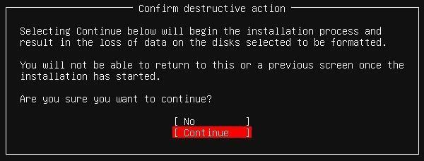

---

###  Step 4: Start the Virtual Machine
- Power on the VM to begin the Ubuntu Server installer.
- Follow installation steps such as:
  - Choose language and keyboard layout  
  - Configure storage, proxy, and network  
  - Set up a user profile

Screenshot:  
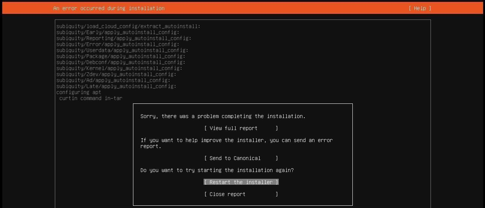

---

###  Step 5: Handle Installation Errors
If an error occurs (e.g. **APT configuration failed**), check:
1. ISO file unblocked properly  
2. Internet connection active  
3. Ubuntu mirror reachable  
4. ISO not corrupted  
5. Disk space sufficient  

Then restart from Step 4 after fixing issues.

Screenshots:  
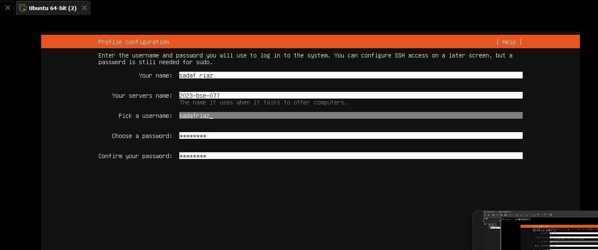  
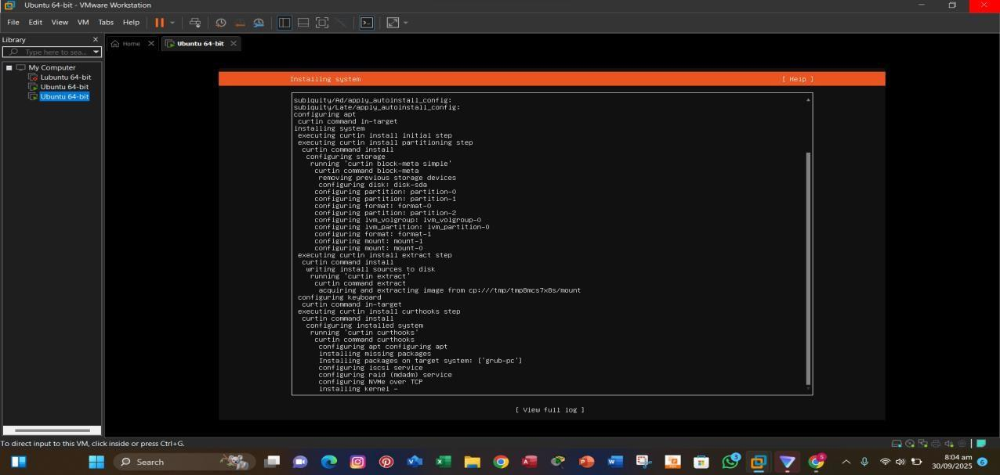

---

###  Step 6: Final Setup
- Complete installation.  
- Log in to Ubuntu using your created credentials.  
- Optionally, connect via **SSH from Windows**.

Screenshots:  
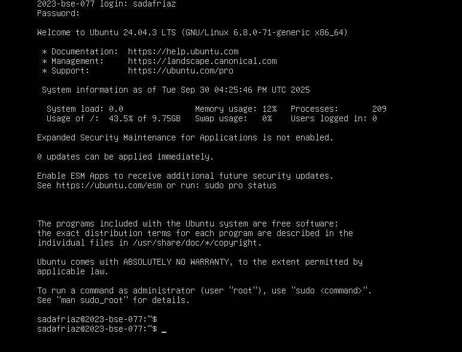  
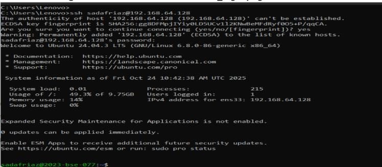

---

##  Conclusion
Successfully installed and configured **Ubuntu Server** in a VMware virtual machine environment.  
Learned about disk configuration, networking setup, and troubleshooting installation errors.

---

?? **Folder Structure**
