CC Lab 06 – Linux Users, Groups, Permissions & Shell Scripting

Student: Sadaf Riaz
Roll No: 2023-BSE-077
Section: BSE-5B
# Lab 06 – User Management, Permissions, Scripts, and Commands
**Student:** Sadaf Riaz  
**Roll No:** 2023-BSE-077  
**Class:** BSE5-B  

---

## 🟦 Task 1 – Switch to Root with `su -`
### Screenshots:
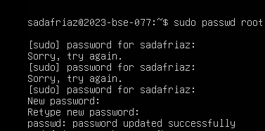  
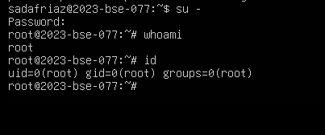  
  

---

## 🟦 Task 2 – Create User *tom* & Verify in passwd/group/shadow
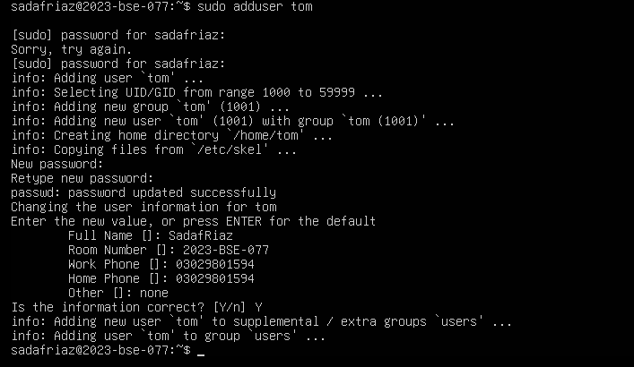  
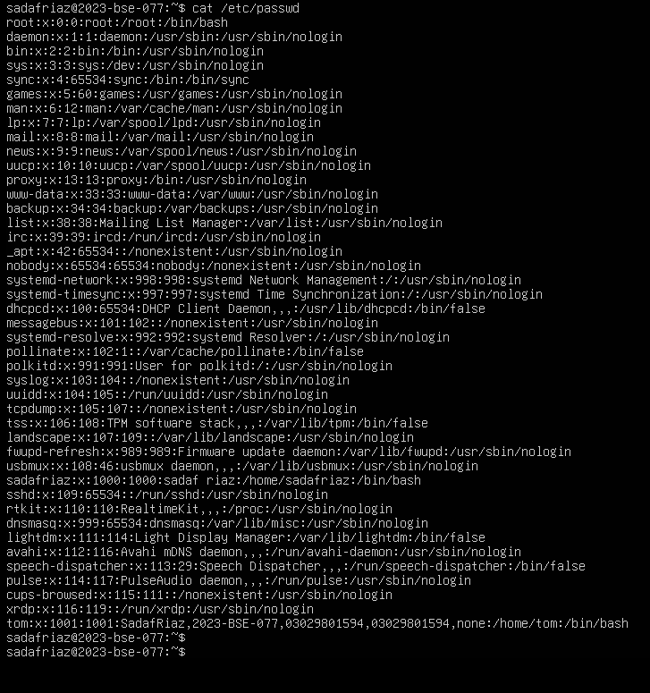  
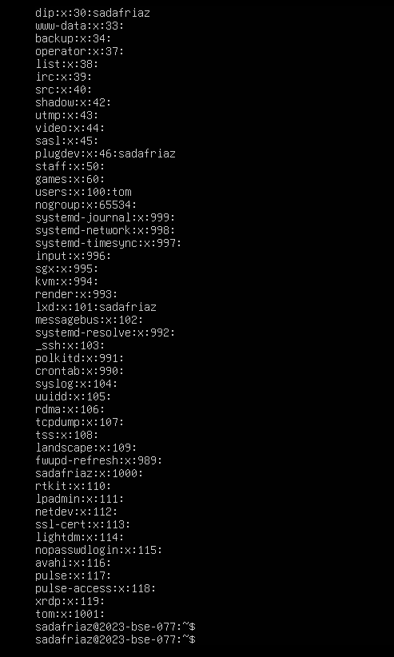  
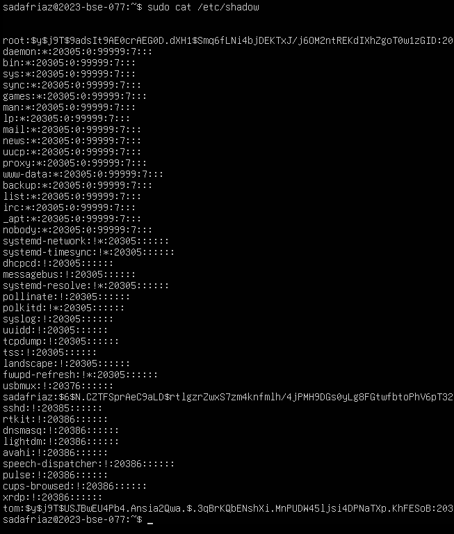  

---

## 🟦 Task 3 – Groups: Primary & Secondary Group Changes
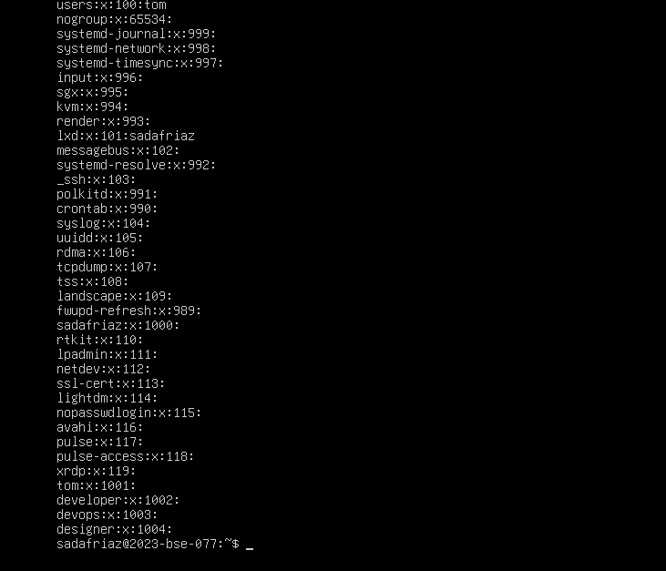  
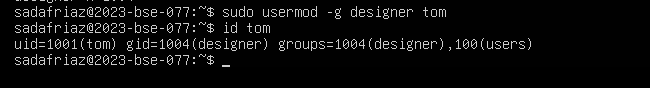  
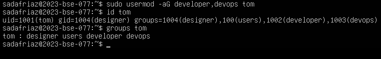  
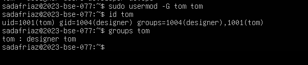  

---

## 🟦 Task 4 – Create/Delete Users & Groups (Jerry, Scooby, jolly, anime)
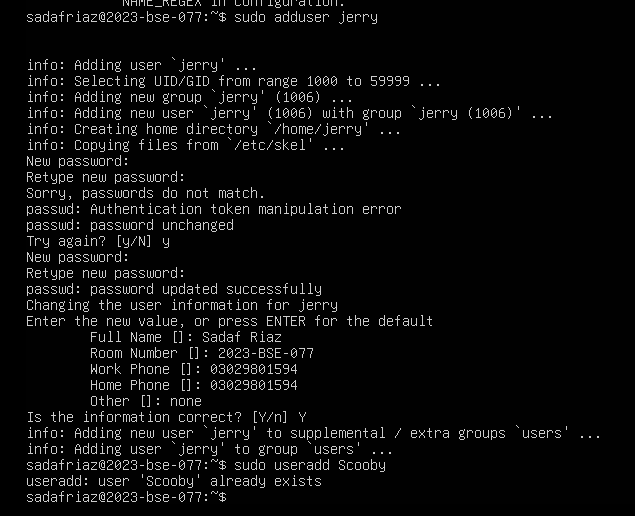  
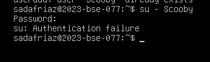  
  
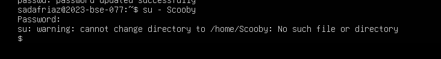  
  
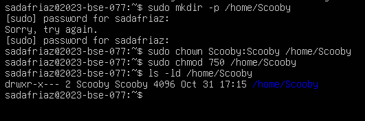  
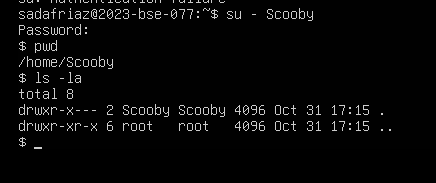  
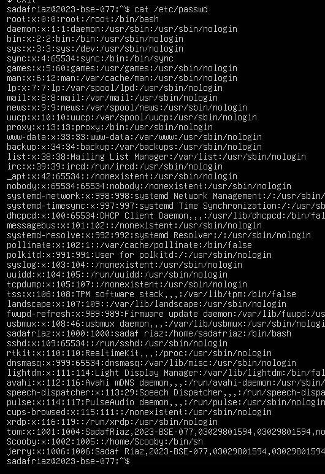  
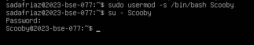  
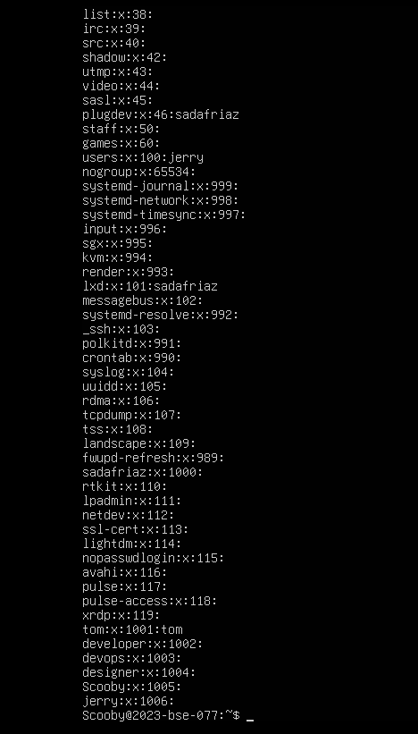  
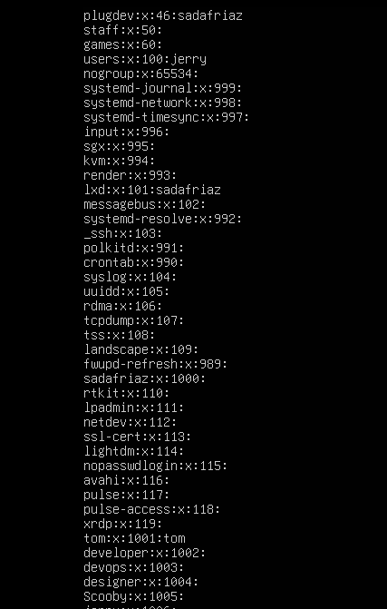  
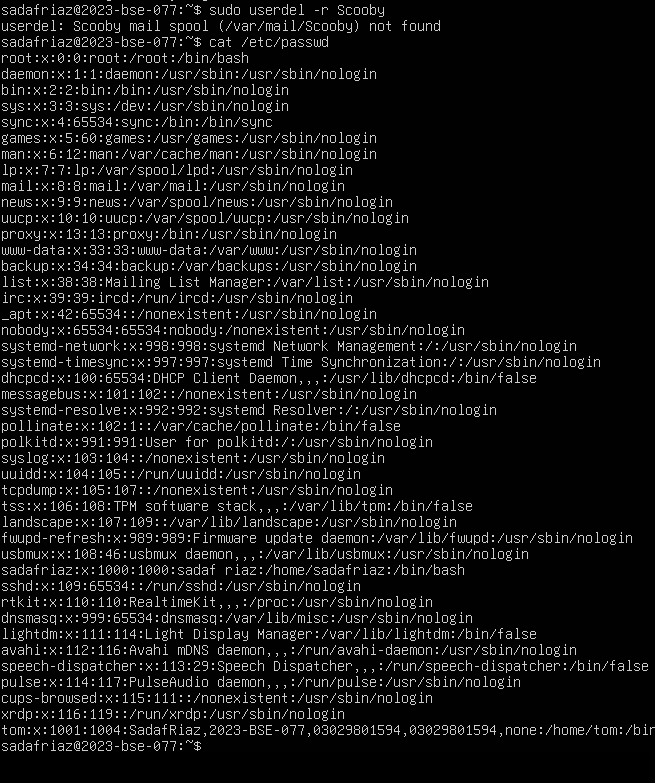  

---

## 🟦 Task 5 – Create Student, Files & Ownership Management
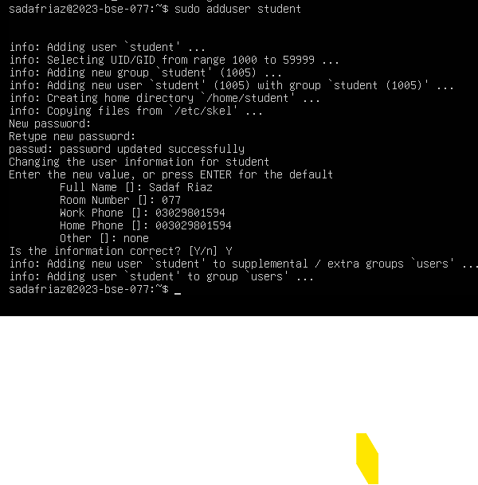  
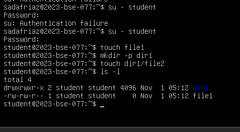  
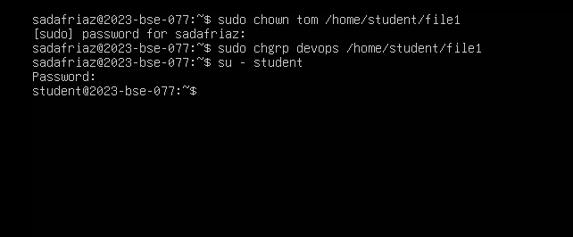  
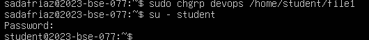  
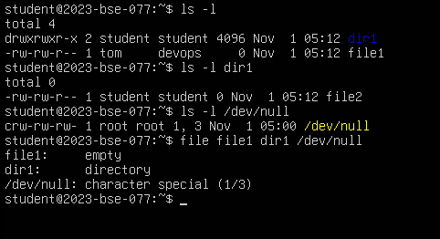  
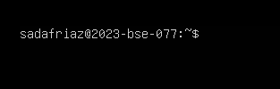  

---

## 🟦 Task 6 – Change Permissions (Symbolic)
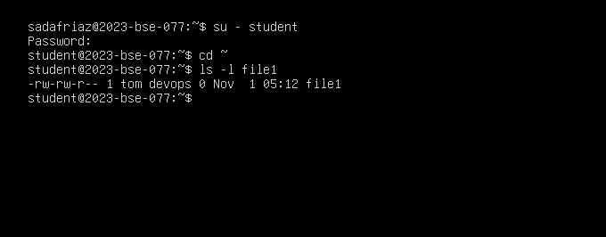  
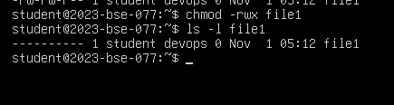  
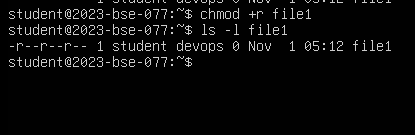  
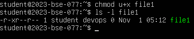  
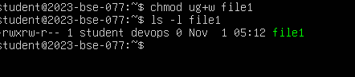  
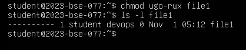  

---

## 🟦 Task 7 – Change Permissions using Set Symbolic (u= g= o=)
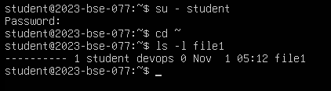  
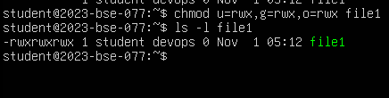  
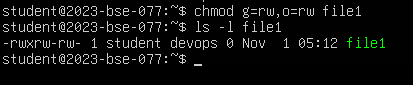  
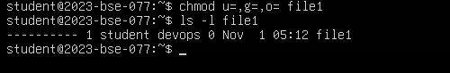  

---

## 🟦 Task 8 – Numeric (Octal) Permissions
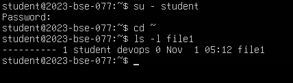  
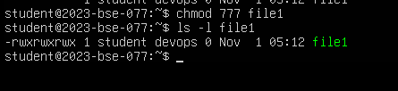  
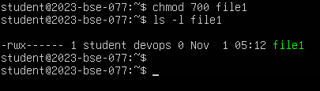  
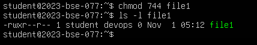  
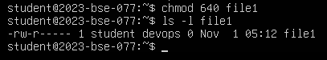  
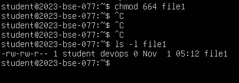  
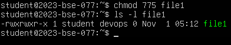  
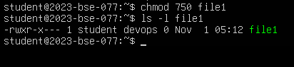  

---

## 🟦 Task 9 – Pipes, grep, Redirects
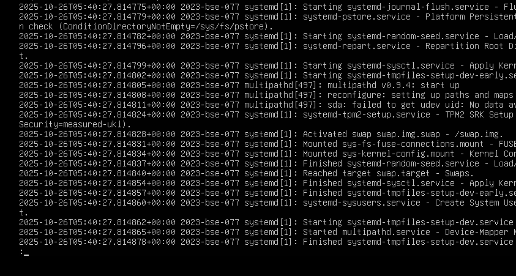  
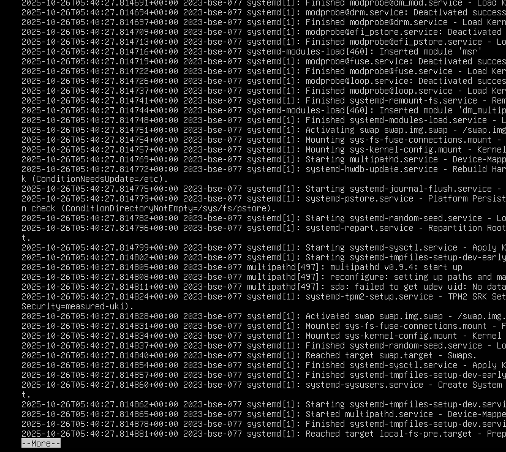  
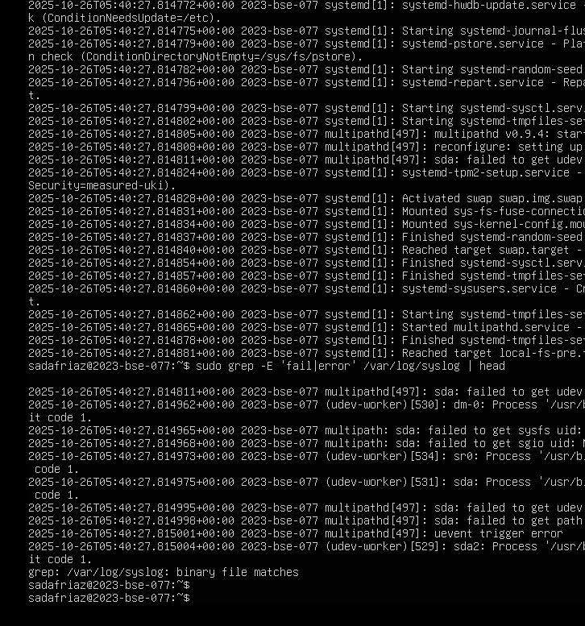  
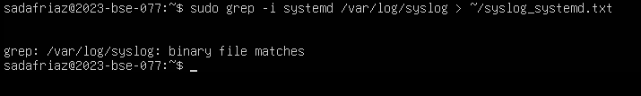  
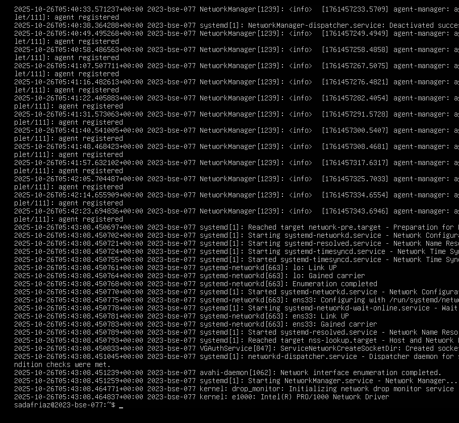  

---

## 🟦 Task 10 – Script setup.sh (Variables, Checks, Substitution)
  
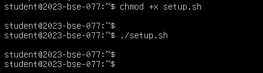  
  
  
  
  
  
  
  
  
  

---

## 🟦 Task 11 – setup.sh (Numeric & String Tests)
  
  
  
  
  
  
  
  
  

---

## 🟦 Task 12 – For Loop Arguments
  
  
  
  

---

## 🟦 Task 13 – While Loop & Functions
  
  
  
  
  
  

---

## 🟦 Task 14 – Codespaces GUI
  
  
  
  
  
  
  
  
  

---

# 🟩 Exam Evaluation Questions (EEQs)

## **Q1 – Group Management and Membership**
  
  
  

---

## **Q2 – Ownership & Permissions**
  
  
  

---

## **Q3 – Pipes, Grep, Redirection**
  
  

---

## **Q4 – Script Variables & Command Substitution**
  
  
  

---

## **Q5 – Numeric & String Comparisons**
  
  
  

---

## **Q6 – For Loop**
  

  
---

## **Q7 – While Loop & Function**
  

---

# ✅ End of README
